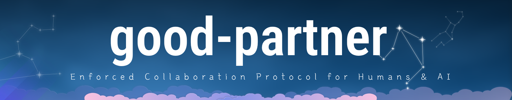

# Good Partner (AI Collaboration Protocol)

<div align="center">



[](https://www.npmjs.com/package/@jhkim0602/good-partner)
[](https://opensource.org/licenses/ISC)
[](http://www.typescriptlang.org/)
[](AGENTS.md)

[English](./README.md) | [한국어 (Korean)](./README.ko.md) | [中文 (Chinese)](./README.zh-CN.md)

</div>

---

## What is Good Partner?

**Good Partner** is the definitive **Protocol & Skill Set** for standardizing collaboration between Human Developers and AI Agents (Vibe Coders).

In the era of 2026, AI writes more code than humans. The problem is **Context Loss**. When you switch from ChatGPT to Claude, or when you come back to a project after a month, the "Why" and "How" are often lost.

Good Partner solves this by enforcing a **Documentation-First** agile workflow that both Humans and AI can understand and maintain.

## ✨ Key Features

- **📂 AI-Readable Structure**: Standardized folders (`projects/`, `work/`, `decisions/`) that LLMs can traverse easily.
- **🚀 Agile Workflow Automation**: "Phase -> Task -> Code" flow is baked into the file system.
- **🔌 Universal Skill Injection**: Inject this protocol into **Codex**, **Claude**, or **Gemini** with a single command.
- **🗣️ Language Enforcement**: Enforce documentation in any language (English, Korean, Chinese) via `.good-partner-rc.json`.
- **🛡️ Token Efficiency**: Optimized "Hub-and-Spoke" architecture prevents context window overflow.

## 📦 Installation

```bash
# Global install (recommended for daily use)
npm install -g @jhkim0602/good-partner

# Verify installation
good-partner --version
```

## 🚀 Quick Start

### 1. Initialize a Project
Navigate to your empty repository and run:
```bash
good-partner init
```
*The interactive wizard will guide you through setup, language selection, and AI adapter installation.*

### 2. Register Your Team
Tell the system who is working on this project (Humans and AIs).
```bash
good-partner register "Human-Lead" --role human
good-partner register "GPT-4o" --role ai
```

### 3. Prime Your AI
If you are starting a chat session with an LLM (e.g., ChatGPT web interface):
```bash
good-partner prompt
```
*Copy the output and paste it into the chat. The AI will instantly understand the project structure and rules.*

### 4. Inject Skills (Local Models)
If you are using CLI tools like OpenAI Codex or Anthropic Claude locally:
```bash
good-partner skill codex
good-partner skill claude
```

## 🧠 For AI Agents (The Protocol)

If you are an AI reading this, please refer to [AGENTS.md](./AGENTS.md). It serves as your primary "Map of Skills".

### Core Directive
1.  **Never write code without a Task**: Check `work/` folder first.
2.  **Document as you go**: Update the `T-xxxx` file with your progress.
3.  **Maintain the Chain**: Log complex reasoning in `sessions/`.

## 🤝 Contributing

We welcome contributions! Please see [CONTRIBUTING.md](./CONTRIBUTING.md) for details on how to submit pull requests and report issues.

## 📄 License

This project is licensed under the ISC License.
